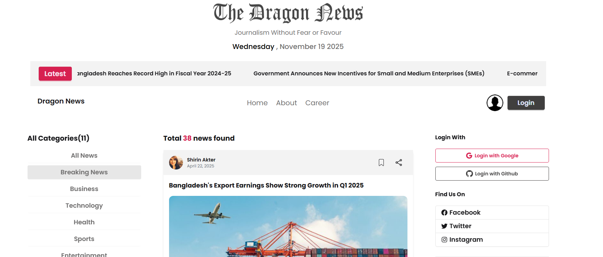

# Dragon News

Dragon News is a dynamic news portal built using **React**, **Tailwind CSS**, and **Firebase**. The platform allows users to browse categorized news, authenticate securely, and enjoy a fully responsive UI for seamless experience across devices.

---

## 📌 Project Overview

Dragon News provides users with the latest news organized by categories. Users can sign in using Firebase Authentication, browse articles by category, and read news seamlessly on any device. The app is optimized for performance and user-friendly interaction using modern UI components.

---

## 🖼️ Project Screenshot

```md

```

*(Replace `screenshot.png` with your actual screenshot file path)*

---

## 🛠️ Technologies Used

* **React**
* **Tailwind CSS**
* **React Router**
* **DaisyUI**
* **React Icons**
* **React Date FS**

---

## 🔑 Authentication

* Firebase Authentication

---

## ⭐ Key Features

* 🔍 Categorized news browsing
* 📱 Fully responsive design
* 🔒 Secure user authentication via Firebase
* ⚡ Fast performance and dynamic content loading
* 🎨 Modern UI with Tailwind CSS & DaisyUI

---

## 📦 Dependencies

```json
"dependencies": {
  "@tailwindcss/vite": "^4.1.14",
    "date-fns": "^4.1.0",
    "firebase": "^12.4.0",
    "lucide-react": "^0.546.0",
    "react": "^19.1.1",
    "react-dom": "^19.1.1",
    "react-fast-marquee": "^1.6.5",
    "react-icons": "^5.5.0",
    "react-router": "^7.9.4",
    "react-spinners": "^0.17.0",
    "tailwindcss": "^4.1.14"
}
```


---

## 🧩 How to Run Locally

1️⃣ Clone the repository

```bash
git clone <your-repo-link>
```

2️⃣ Navigate into the project folder

```bash
cd dragon-news
```

3️⃣ Install dependencies

```bash
npm install
```

4️⃣ Start the development server

```bash
npm start
```

5️⃣ Open in your browser

```
http://localhost:3000
```

---

## 🌐 Live Demo

🔗 [Dragon News Live](https://dragon-news-for-breaking.web.app/category/1)
